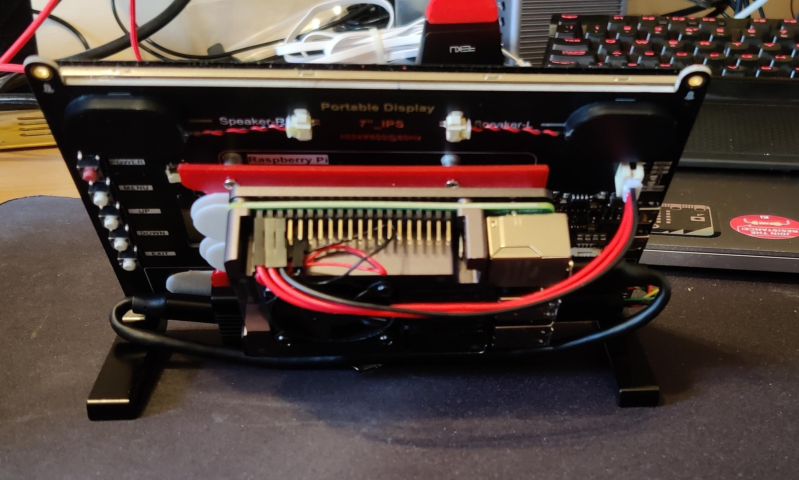
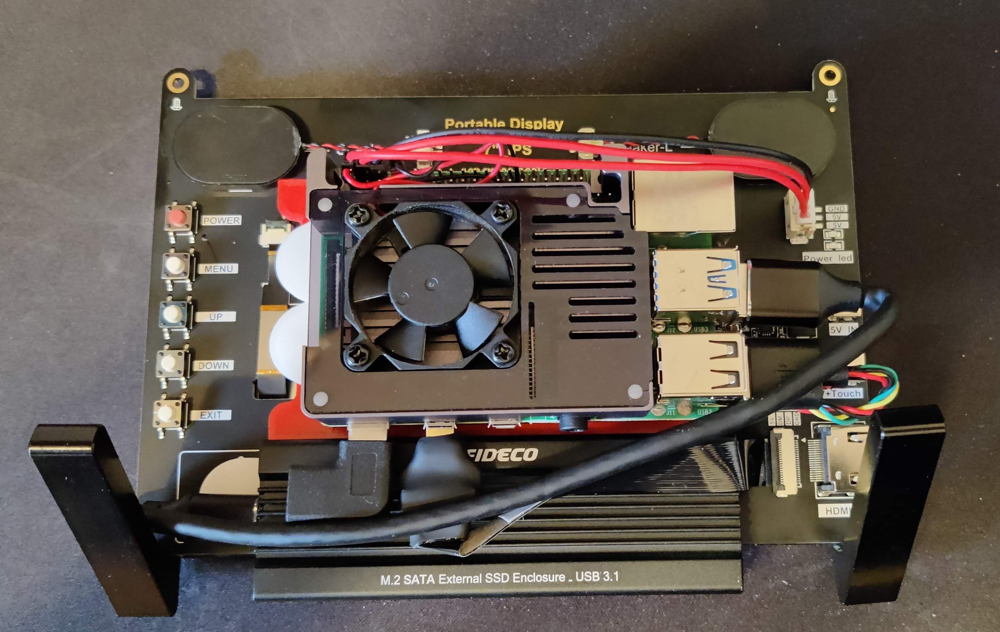

*Work in progress*

# Raspberry Pi 4 Kiosk Config

How I configure a Raspberry Pi 4 in kiosk mode

For my screen I'm using the [EVICIV 7 Inch Touchscreen](https://www.amazon.co.uk/gp/product/B07Q2LBWYK). This screen runs at 1024 x 600, this is not a standard size. Making this work is simple but google provides a lot of conflicting information.

To get it working, edit `/boot/config.txt` and add these lines at the end, save and reboot.

```
hdmi_force_hotplug=1
hdmi_cvt=1024 600 60 3
hdmi_group=2
hdmi_mode=88
```

# Configure Pixel Desktop

## Pixel Desktop Autostart

The [autostart](autostart) script should be placed into the directory

    mkdir -p ~/.config/lxsession/LXDE-pi/
    cp autostart ~/.config/lxsession/LXDE-pi/autostart

## Starting Chromium in Kiosk mode

The [boot-kiosk.sh](boot-kiosk.sh) script is called from the [autostart](autostart) script, it simply launches the chromium browser in `kiosk` mode to the URL provided in the script.

# Controlling the Kiosk display

The [kioskctl](kioskctl) script does a number of functions through a simple `case` statement. This script can be calld via cron or another script that prehaps is connected to motion sensor to power on the HDMI display or power it off when not require.

This script also allows you to open preset URL's or just give it any URL you'd like to have opened in the browser.

# Extra stuff

Initially I mounted the Pi4 on the back of the monitor using the 4 mounting studs, and this is fine, however, without any kind of additional cooling, I wasn't confortable with the heat the Pi was generating. Depending on the case you have, you might be able to screw that case with the pi directly into the 4 studs, but I could not.

So, I decided to 3D print a small mounting plate to attach to the 4 studs, then on to this I would mount my Raspberry PI in it's [aluminum case](https://www.amazon.co.uk/gp/product/B081R54N7Z) using 3M velcro command strips (makes it easy to take off).

The [STL file](3D-print-files/PI4_Mounting_Plate_v1.0.stl) was quick and simple solution.

Here are a couple of pics of the setup





The PI is booting off and running from a 256GB SSD mounted in a [FIDECO M.2 SATA](https://www.amazon.co.uk/gp/product/B07TTG66GW) case over USB3.0. The speeds are great with this setup.

Write test

```
$ dd if=/dev/zero of=speedTestFile bs=20M count=5 oflag=direct
5+0 records in
5+0 records out
104857600 bytes (105 MB, 100 MiB) copied, 0.520918 s, 201 MB/s
```

Read Test

```
$ dd if=speedTestFile of=/dev/zero bs=20M count=5 oflag=dsync
5+0 records in
5+0 records out
104857600 bytes (105 MB, 100 MiB) copied, 0.494158 s, 212 MB/s
```

----
This is still a work in progress as I develop it for my needs. Feel free to use the scripts and such. 
