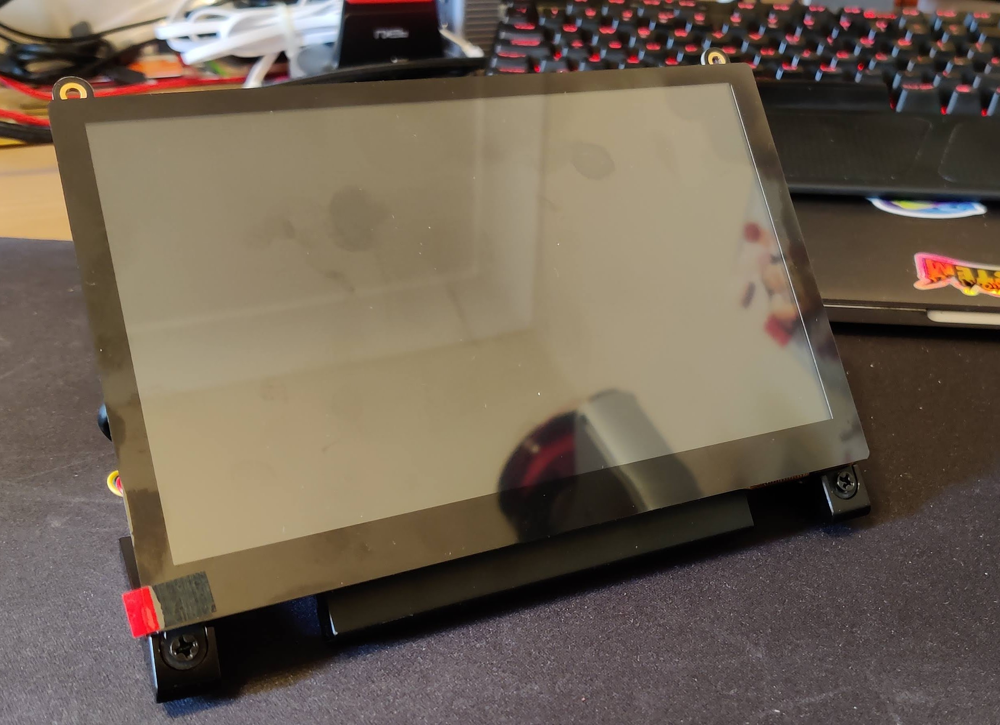

*Still a work in progress*

# Raspberry Pi 4 Kiosk Config

How I configure a Raspberry Pi 4 in kiosk mode

## Configure the Screen

For my screen I'm using the [EVICIV 7 Inch Touchscreen](https://www.amazon.co.uk/gp/product/B07Q2LBWYK). This screen runs at 1024 x 600, this is not a standard size. Making this work is simple but google provides a lot of conflicting information.

To get it working, edit `/boot/config.txt` and add these lines at the end, save and reboot.

```
hdmi_force_hotplug=1
hdmi_cvt=1024 600 60 3
hdmi_group=2
hdmi_mode=88
```

# Install these scripts

Some packages you'll need to have installed for this to work, on top of LXDE and Chromium

    unclutter
    libcec4 
    cec-utils
    xdotool
    xautomation

By default the `autostart` script will look for `~/kiosk/boot-kiosk.sh` and all the scripts will look for the config file as `~/.kiosk.cfg`

    git clone https://github.com/M1XZG/Raspberry-pi-kiosk-config.git ~/kiosk
    cd ~/kiosk
    mkdir -p ~/.config/lxsession/
    cp autostart ~/.config/lxsession/autostart
    cp .kiosk.cfg ~/

If you already have LXDE Desktop running, restart this by using

    sudo service lightdm restart

You may want to either add `~/kiosk` to your `$PATH` or symlink the `kioskctl` script to somewhere in your path to make it easier to run. 

# Configure Pixel Desktop

## Pixel Desktop Autostart

The [autostart](autostart) script will fire when the deskop launches, this will call the [boot-kiosk.sh](boot-kiosk.sh) script. This script will then load the first URL found in your [urls-kiosk.txt](urls-kiosk.txt) file and start chromium with this URL.

## Starting Chromium in Kiosk mode

The [boot-kiosk.sh](boot-kiosk.sh) script is called from the [autostart](autostart) script, as mentioned above, the script finds the first URL in your list and loads this. 

Once Chromium is loaded it will go into an indefinate loop refreshing the browser window based on the `REFRESH` variable set in the `.kiosk.cfg` file. One thing the script does is each time the loop runs it will recheck the `.kiosk.cfg` file incase you decide to change the refresh time frame on the fly (no restarts needed if you want to change it). If you wish to have no refresh just set the variable to `NONE` and the `boot-kiosk.sh` scrip will go into a 20 second loop checking the value but will never actually refresh the browser.

# Controlling the Kiosk display

The [kioskctl](kioskctl) script does a number of functions through a simple `case` statement. This script can be calld via cron or another script that prehaps is connected to motion sensor to power on the HDMI display or power it off when not require.

For help on what the script can do, run `kioskctl -h`

This script also allows you to open preset URL's or just give it any URL you'd like to have opened in the browser.

# Extra stuff

Initially I mounted the Pi4 on the back of the monitor using the 4 mounting studs, and this is fine, however, without any kind of additional cooling, I wasn't confortable with the heat the Pi was generating. Depending on the case you have, you might be able to screw that case with the pi directly into the 4 studs, but I could not.

So, I decided to 3D print a small mounting plate to attach to the 4 studs, then on to this I would mount my Raspberry PI in it's [aluminum case](https://www.amazon.co.uk/gp/product/B081R54N7Z) using 3M velcro command strips (makes it easy to take off).

The [STL file](3D-print-files/PI4_Mounting_Plate_v1.0.stl) was quick and simple solution.

Here are a couple of pics of the setup




The PI is booting off and running from a 256GB SSD mounted in a [FIDECO M.2 SATA](https://www.amazon.co.uk/gp/product/B07TTG66GW) case over USB3.0. The speeds are great with this setup.

Write test

```
$ dd if=/dev/zero of=speedTestFile bs=20M count=5 oflag=direct
5+0 records in
5+0 records out
104857600 bytes (105 MB, 100 MiB) copied, 0.520918 s, 201 MB/s
```

Read Test

```
$ dd if=speedTestFile of=/dev/zero bs=20M count=5 oflag=dsync
5+0 records in
5+0 records out
104857600 bytes (105 MB, 100 MiB) copied, 0.494158 s, 212 MB/s
```

----
This is still a work in progress as I develop it for my needs. Feel free to use the scripts and such. 

If you want to add to the scripts or have any corrections to the docs, please feel free to `fork` this repo and submit a `pull request` for review.